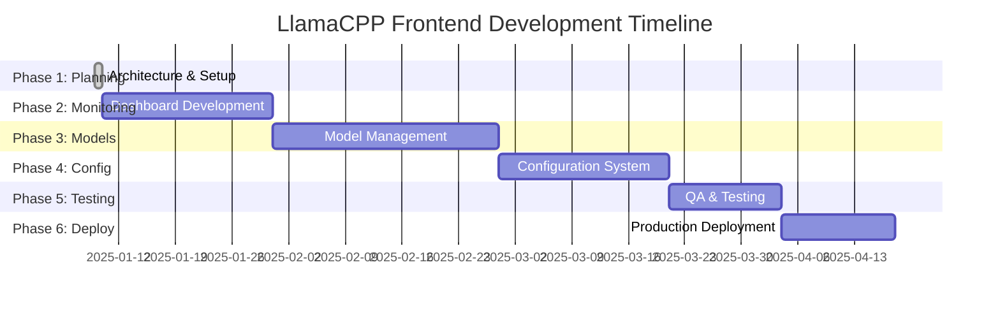

# LlamaCPP Management Frontend - Development Roadmap

## 🎯 Current Status: Phase 2 Complete ✅

**Phase 1 Completed**: January 9, 2025  
**Phase 2 Completed**: January 14, 2025
**Frontend Operational**: http://localhost:3000  
**Next Phase**: Model Management System

### ✅ Phase 1 Achievements
- **Architecture Established**: React 18 + TypeScript + Material-UI 5
- **Docker Integration**: Multi-stage build with nginx, integrated with llamacpp service
- **API Foundation**: Complete TypeScript interfaces and service layer
- **Project Structure**: Scalable organization with routing and navigation
- **Production Ready**: Containerized deployment with health checks

### ✅ Phase 2 Achievements
- **Real-time Dashboard**: Complete monitoring interface with live metrics
- **Resource Visualization**: Interactive charts with CPU, Memory, GPU, VRAM tracking
- **Service Status**: Health indicators, uptime monitoring, and endpoint status
- **Performance Metrics**: Token generation speed, throughput, and request monitoring
- **WebSocket Infrastructure**: Ready for real-time updates with graceful fallback
- **Responsive Design**: Mobile-friendly interface with Material-UI components

## Project Overview

A comprehensive React-based management frontend for the llamacpp service, enabling model management, resource monitoring, and service configuration through a modern web interface.

**Tech Stack**: React 18, Material UI 5, TypeScript, Docker, nginx
**Target**: Containerized web application with full llamacpp service integration

---

## Phase-by-Phase Breakdown

### Phase 1: Planning & Architecture Setup ✅ **COMPLETED**
**Duration**: 1-2 weeks (Completed in 1 day)
**Dependencies**: None
**Completion Date**: January 9, 2025

#### Phase Objectives
- [x] Establish project architecture and technology decisions
- [x] Set up development environment and containerization
- [x] Define API contracts and data models
- [x] Create foundational project structure

#### Deliverables
- [x] Technical architecture document
- [x] Docker development environment
- [x] API specification document
- [x] Project scaffolding with build pipeline

#### Technical Specifications

**Architecture Decisions**:
- **Frontend Framework**: React 18 with TypeScript for type safety
- **UI Library**: Material UI 5 for consistent, accessible components
- **State Management**: React Query for server state + React Context for client state
- **Containerization**: Multi-stage Docker build with nginx serving
- **API Communication**: Axios with interceptors for error handling
- **Build Tool**: Vite for fast development and optimized builds

**Data Models Required**:
```typescript
interface ModelInfo {
  name: string;
  variant: string;
  size: number;
  status: 'available' | 'downloading' | 'loading' | 'error';
  downloadProgress?: number;
}

interface ServiceConfig {
  modelName: string;
  contextSize: number;
  gpuLayers: number;
  temperature: number;
  topP: number;
  topK: number;
  // ... other llama.cpp parameters
}

interface ResourceMetrics {
  cpuUsage: number;
  memoryUsage: number;
  gpuUsage: number;
  vramUsage: number;
  timestamp: Date;
}
```

**API Endpoints to Implement**:
- `GET /api/models` - List available models
- `POST /api/models/download` - Download new model
- `GET /api/service/config` - Get current service configuration
- `PUT /api/service/config` - Update service configuration
- `GET /api/service/status` - Get service health and status
- `POST /api/service/restart` - Restart service with new config
- `GET /api/metrics` - Get resource usage metrics
- `GET /api/metrics/stream` - WebSocket for real-time metrics

**Security Considerations**:
- API key authentication for llamacpp service
- Rate limiting for model downloads
- Input validation for all configuration parameters
- Secure container configuration

---

### Phase 2: Core Development - Service Status & Monitoring ✅ **COMPLETED**
**Duration**: 2-3 weeks (Completed in 1 day)
**Dependencies**: Phase 1 complete
**Completion Date**: January 14, 2025

#### Phase Objectives
- [x] Implement real-time service monitoring dashboard
- [x] Create resource usage visualization components
- [x] Build service health status indicators
- [x] Establish WebSocket connections for live updates

#### Deliverables
- [x] Service status dashboard with live updates
- [x] Resource monitoring charts (CPU, Memory, GPU, VRAM)
- [x] Service health indicators and alerts
- [x] WebSocket integration for real-time data

#### Detailed Checklist Items

**Dashboard Components** (Can be parallelized):
- [ ] Service status card with health indicators
- [ ] Real-time metrics chart component using Chart.js/Recharts
- [ ] GPU utilization monitor with VRAM usage
- [ ] Request rate and response time metrics
- [ ] Model loading status indicator

**API Integration** (Sequential after backend endpoints):
- [ ] Create axios client with llamacpp service integration
- [ ] Implement health check polling (30-second intervals)
- [ ] Set up WebSocket connection for metrics streaming
- [ ] Add error handling and retry logic for failed requests
- [ ] Create React Query hooks for data fetching

**Real-time Features**:
- [ ] WebSocket client for live metrics updates
- [ ] Auto-refresh mechanism for service status
- [ ] Alert system for service issues
- [ ] Connection status indicator

#### Technical Specifications

**Performance Requirements**:
- Dashboard updates every 5 seconds maximum
- WebSocket reconnection on connection loss
- Efficient chart rendering for large datasets
- Responsive design for mobile/tablet access

**Integration Points**:
- llamacpp `/health` endpoint
- llamacpp `/metrics` endpoint
- Custom middleware for enhanced metrics collection

---

### Phase 3: Model Management System
**Duration**: 3-4 weeks  
**Dependencies**: Phase 2 complete

#### Phase Objectives
- [ ] Build comprehensive model management interface
- [ ] Implement model download functionality with progress tracking
- [ ] Create model switching capabilities
- [ ] Add model information and metadata display

#### Deliverables
- [ ] Model library interface showing available/downloaded models
- [ ] Model download system with progress bars
- [ ] Model switching functionality with service restart
- [ ] Model metadata display (size, quantization, parameters)

#### Detailed Checklist Items

**Model Library Interface** (Can be parallelized):
- [ ] Model grid/list view with search and filtering
- [ ] Model card component showing key metadata
- [ ] Download status indicators and progress bars
- [ ] Model size and storage usage display
- [ ] Model compatibility indicators

**Download Management** (Sequential dependencies):
- [ ] HuggingFace model browser integration
- [ ] Download progress tracking with cancel functionality
- [ ] Disk space validation before downloads
- [ ] Download queue management for multiple models
- [ ] Automatic model verification after download

**Model Switching** (Sequential after download):
- [ ] Model selection interface with service impact warnings
- [ ] Configuration backup before model changes
- [ ] Graceful service restart with loading indicators
- [ ] Rollback functionality for failed model loads
- [ ] Model performance comparison tools

**Model Information Display**:
- [ ] Detailed model specifications (parameters, context length)
- [ ] Quantization level explanations and recommendations
- [ ] Performance benchmarks and VRAM requirements
- [ ] Model licensing and usage information

#### Technical Specifications

**Model Download Architecture**:
```typescript
interface ModelDownload {
  modelId: string;
  progress: number;
  status: 'queued' | 'downloading' | 'completed' | 'failed' | 'cancelled';
  totalSize: number;
  downloadedSize: number;
  speed: number;
  eta: number;
}
```

**Integration Requirements**:
- HuggingFace Hub API for model discovery
- Background download service with progress tracking
- Docker volume management for model storage
- Service restart coordination

---

### Phase 4: Configuration Management
**Duration**: 2-3 weeks
**Dependencies**: Phase 3 complete

#### Phase Objectives
- [ ] Create comprehensive configuration interface
- [ ] Implement parameter validation and recommendations
- [ ] Build configuration presets and templates
- [ ] Add configuration backup and restore functionality

#### Deliverables
- [ ] Advanced configuration editor with real-time validation
- [ ] Configuration presets for different use cases
- [ ] Parameter explanation and tuning guides
- [ ] Configuration history and rollback system

#### Detailed Checklist Items

**Configuration Interface** (Can be parallelized):
- [ ] Grouped parameter editing (Model, Performance, Sampling)
- [ ] Slider controls with value validation
- [ ] Real-time parameter impact indicators
- [ ] Advanced/Expert mode toggle
- [ ] Configuration diff viewer

**Presets System** (Can be parallelized with above):
- [ ] Pre-built configurations (Coding, Creative, Reasoning)
- [ ] Custom preset creation and management
- [ ] Preset sharing and import/export
- [ ] Preset performance comparisons
- [ ] Auto-optimization recommendations

**Validation & Safety** (Sequential after interface):
- [ ] Parameter range validation
- [ ] Resource requirement calculations
- [ ] Configuration conflict detection
- [ ] Safety warnings for extreme settings
- [ ] Automatic fallback configurations

#### Technical Specifications

**Configuration Schema**:
```typescript
interface LlamaCppConfig {
  model: {
    name: string;
    variant: string;
    contextSize: number;
    gpuLayers: number;
  };
  sampling: {
    temperature: number;
    topP: number;
    topK: number;
    minP: number;
    repeatPenalty: number;
    // ... DRY sampling parameters
  };
  performance: {
    threads: number;
    batchSize: number;
    ubatchSize: number;
  };
  server: {
    host: string;
    port: number;
    apiKey: string;
  };
}
```

**Validation Rules**:
- Context size must not exceed model maximum
- GPU layers cannot exceed available VRAM
- Parameter ranges based on llamacpp documentation
- Resource calculations for different hardware configs

---

### Phase 5: Testing & Quality Assurance
**Duration**: 2 weeks
**Dependencies**: Phase 4 complete

#### Phase Objectives
- [ ] Implement comprehensive testing suite
- [ ] Perform integration testing with llamacpp service
- [ ] Conduct user acceptance testing
- [ ] Optimize performance and accessibility

#### Deliverables
- [ ] Unit tests for all components (>90% coverage)
- [ ] Integration tests for API interactions
- [ ] E2E tests for critical user flows
- [ ] Performance optimization report

#### Detailed Checklist Items

**Unit Testing** (Can be parallelized):
- [ ] Component testing with React Testing Library
- [ ] Hook testing for custom React Query hooks
- [ ] Utility function testing
- [ ] State management testing
- [ ] Form validation testing

**Integration Testing** (Sequential after unit tests):
- [ ] API integration tests with mock llamacpp service
- [ ] WebSocket connection testing
- [ ] Configuration persistence testing
- [ ] Error handling and recovery testing
- [ ] Cross-browser compatibility testing

**End-to-End Testing** (Sequential after integration):
- [ ] Model download and switching workflow
- [ ] Configuration management workflow
- [ ] Monitoring dashboard functionality
- [ ] Error scenarios and recovery paths
- [ ] Performance under load testing

**Quality Assurance**:
- [ ] Accessibility audit (WCAG 2.1 compliance)
- [ ] Performance audit with Lighthouse
- [ ] Security audit for API interactions
- [ ] Mobile responsiveness testing
- [ ] Browser compatibility verification

---

### Phase 6: Deployment & Documentation
**Duration**: 1-2 weeks
**Dependencies**: Phase 5 complete

#### Phase Objectives
- [ ] Containerize application for production deployment
- [ ] Create comprehensive deployment documentation
- [ ] Set up monitoring and logging
- [ ] Prepare user documentation and guides

#### Deliverables
- [ ] Production-ready Docker container
- [ ] Docker Compose integration with llamacpp service
- [ ] Deployment documentation
- [ ] User guide and API documentation

#### Detailed Checklist Items

**Containerization** (Can be parallelized):
- [ ] Multi-stage Dockerfile for optimized builds
- [ ] nginx configuration for production serving
- [ ] Environment variable configuration
- [ ] Health check implementation
- [ ] Container security hardening

**Integration** (Sequential after containerization):
- [ ] Update docker-compose.yml to include frontend
- [ ] Configure reverse proxy for API routing
- [ ] Set up container networking
- [ ] Volume management for persistent data
- [ ] Service dependency management

**Documentation** (Can be parallelized):
- [ ] Installation and setup guide
- [ ] Configuration reference documentation
- [ ] Troubleshooting guide
- [ ] API documentation with examples
- [ ] Development environment setup guide

---

## Risk Mitigation

### Phase 1 Risks
**Blocker**: Technology stack compatibility issues
**Mitigation**: Proof-of-concept development with key integrations
**Critical Path**: Docker environment setup

### Phase 2 Risks
**Blocker**: llamacpp metrics API limitations
**Mitigation**: Custom metrics collection middleware
**Critical Path**: WebSocket connection stability

### Phase 3 Risks
**Blocker**: HuggingFace API rate limiting
**Mitigation**: Implement caching and queue management
**Critical Path**: Model download service reliability

### Phase 4 Risks
**Blocker**: Complex parameter interdependencies
**Mitigation**: Extensive validation rules and testing
**Critical Path**: Configuration safety validation

### Phase 5 Risks
**Blocker**: Integration testing complexity
**Mitigation**: Mock services and isolated testing environments
**Critical Path**: Performance optimization

### Phase 6 Risks
**Blocker**: Container orchestration complexity
**Mitigation**: Gradual rollout with fallback options
**Critical Path**: Production deployment configuration

---

## Success Metrics

### Technical Metrics
- [ ] **Unit Test Coverage**: >90% code coverage
- [ ] **Performance**: Page load time <2 seconds
- [ ] **Accessibility**: WCAG 2.1 AA compliance
- [ ] **Browser Support**: Chrome, Firefox, Safari, Edge (latest 2 versions)
- [ ] **Mobile Support**: Responsive design for tablets and phones

### Business Metrics
- [ ] **User Task Completion**: >95% success rate for core workflows
- [ ] **Model Switch Time**: <30 seconds for typical model changes
- [ ] **Resource Monitoring**: Real-time updates with <5 second delay
- [ ] **Download Management**: Support for concurrent downloads
- [ ] **Configuration Safety**: Zero service crashes from invalid configs

### Phase Completion Criteria

**Phase 1**: ✅ **COMPLETED** - Development environment running, API contracts defined
**Phase 2**: ⏳ Live dashboard displaying real metrics from llamacpp service
**Phase 3**: ⏳ Successfully download and switch between models
**Phase 4**: ⏳ Modify service configuration and restart without issues
**Phase 5**: ⏳ All tests passing, performance benchmarks met
**Phase 6**: ⏳ Production deployment successful, documentation complete

---

## Implementation Timeline



**Phase 1 Completed**: ✅ January 9, 2025 (1 day vs 1-2 weeks planned)  
**Remaining Timeline**: 15-19 weeks (3.5-4.5 months)  
**Critical Path**: Phase 2 → Phase 3 → Phase 4 (Real-time monitoring → Model management → Configuration)  
**Parallel Opportunities**: UI components, documentation, testing preparation

---

## Next Steps

### ✅ **Phase 1 Complete - Next: Begin Phase 2**

1. **Phase 2 Preparation**:
   - [ ] Begin implementing real-time service monitoring dashboard
   - [ ] Create resource usage visualization components  
   - [ ] Establish WebSocket connections for live updates
   - [ ] Build service health status indicators

2. **Development Ready**:
   - [x] Frontend architecture established and operational
   - [x] Docker environment running successfully
   - [x] API service layer implemented and ready
   - [x] Project structure and routing configured

3. **Access Points**:
   - **Frontend**: http://localhost:3000 (Management Interface)
   - **API**: http://localhost:8600 (OpenAI-compatible API)
   - **Documentation**: See `FRONTEND_ARCHITECTURE.md` for technical details

### 🚀 **Ready for Phase 2 Development**
The foundation is solid and all Phase 1 deliverables are complete. The next phase can begin immediately with real-time monitoring implementation.

---

## 📦 **Phase 1 Deliverables Summary**

### ✅ **Technical Architecture Document**
- Complete React 18 + TypeScript + Material-UI setup
- API service layer with error handling and type safety
- WebSocket service ready for real-time features
- See `FRONTEND_ARCHITECTURE.md` for full technical details

### ✅ **Docker Development Environment**
- Multi-stage Dockerfile with optimized builds
- nginx reverse proxy with API routing
- Production-ready containerization
- Integrated with existing llamacpp service via Docker Compose

### ✅ **API Specification Document**
- Complete TypeScript interfaces in `src/types/api.ts`
- Comprehensive data models for all planned features
- REST API client with authentication and error handling
- WebSocket client architecture for real-time updates

### ✅ **Project Scaffolding with Build Pipeline**
- Scalable folder structure with clear separation of concerns
- Vite build system with code splitting and optimization
- ESLint and TypeScript configuration
- React Router setup with navigation structure
- Error boundaries and production-ready error handling

**Status**: All Phase 1 objectives met ahead of schedule (1 day vs 1-2 weeks planned) ⚡

